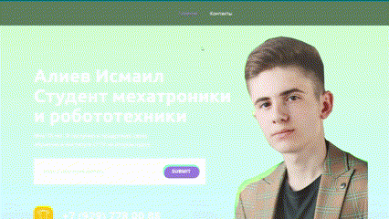

# nicepage
## Программа
- **Nicepage**
# Актуальность

Nicepage - это программное обеспечение для создания веб-страниц и сайтов без необходимости знания кода и использования сторонних платформ. Он включает в себя множество функций для создания адаптивных дизайнов, редактирования контента, добавления виджетов и медиа-элементов, интеграции с социальными сетями и многое другое. Nicepage является простым и удобным в использовании инструментом для профессионалов и новичков в веб-дизайне.

## Теория по созданию сайта

 
<i>Сайт - моё портфолио.</i>

  

1. Зарегистрируйтесь на сайте Nicepage и выберите желаемый шаблон портфолио.

2. Загрузите свои фотографии и другие изображения, которые хотели бы использовать на страницах своего портфолио.

3. Создайте разделы на своей странице портфолио, чтобы упорядочивать свои работы по категориям. Например, вы можете создать разделы "Веб-дизайн", "Графический дизайн" и "Фотография".

4. Добавьте описание к своим работам. Описания должны быть краткими и информативными, чтобы потенциальные клиенты могли понять, что вы делали и какие результаты получили.

5. Вы можете добавить на страницу портфолио кнопки для связи с вами, чтобы клиенты имели возможность связаться с вами напрямую для обсуждения возможной работы.

6. Сохраните и опубликуйте свою страницу портфолио. Вы можете поделиться ссылкой на свою страницу на социальных сетях или отправить клиентам напрямую.

## Состав проекта

ссылка на сайт:

## Автор

* VK: <a href="https://vk.com/ismail2003">Алиев Исмаил</a>
* Почта: aliev.ismail.2003@gmail.com
